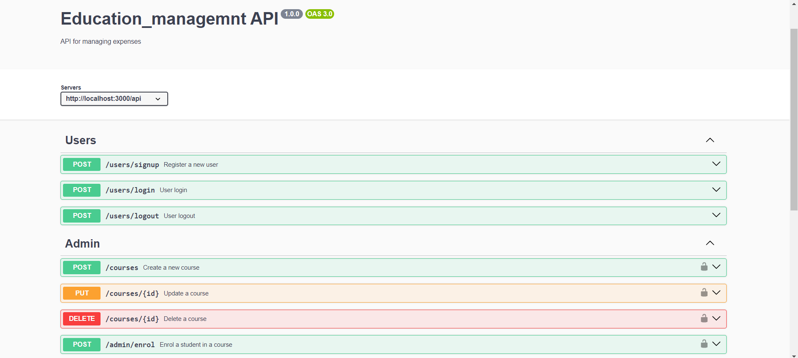
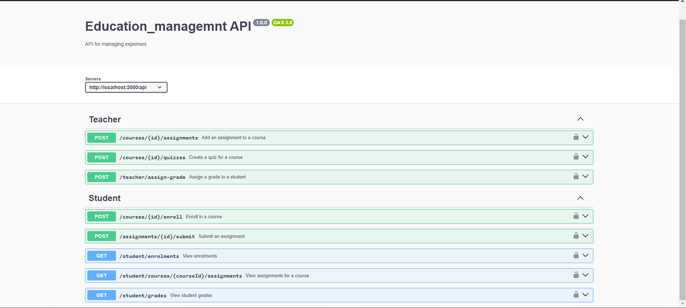

<h1 align="center">MERN-Backend Education_Management</h1>


About This project:

-   ⚛️ Tech Stack:  Node.js, Express.js, MongoDB
-   🎥 pdf  file Uploading using multer 
-   🔐 Authentication with JWT
-   🔐 Authentication & Authorizations 
-   🎬 **Admin**: Can create, update, and delete courses, enroll/remove students.
-   🎬 **Teachers**: Can add assignments, create quizzes, and assign grades to students.
-   🎬  **Students**: Can enroll in courses, submit assignments, view their grades, and check their enrollment status.
-   🎬  Role base work
-   🐱‍👤 Get Similar Education Creation API
-   🐱‍👤 Swagger for API Documentation


## Expense Swagger UI



<br>




### Setup .env file

```bash
DATABASE_URL=Your_mongo_url
PORT=Sevice_port
NODE_ENV=NODE_ENVIRINMENT
JWT_SECRET=jwt_secret
```

### Run this app locally

```shell
npm run build
```

### Start the app

```shell
npm start
```
